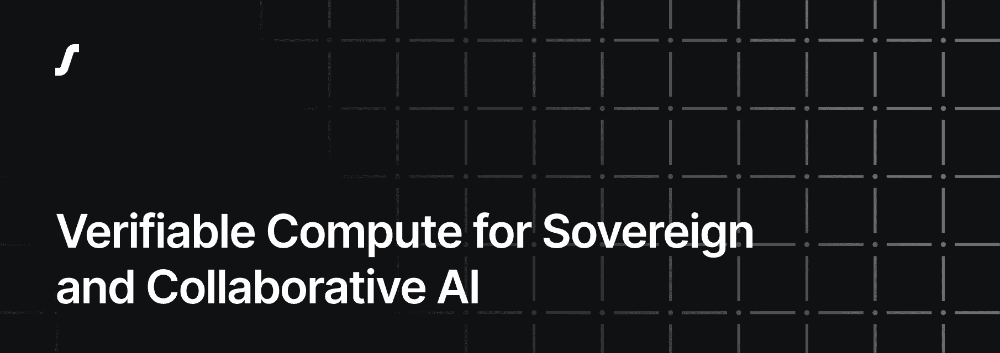

Super Protocol is a **decentralized, confidential computing platform and AI cloud** that lets organizations run sensitive AI workloads securely on any infrastructure while keeping data, models, and code protected during execution. It provides hardware-enforced data isolation, cryptographic verification of all operations, and a neutral, cloud-agnostic architecture to enable verifiable, compliant, and collaborative AI workflows without exposing raw assets.

Super Protocol CLI: [SPCTL](https://github.com/Super-Protocol/ctl) and [Provider Tools](https://github.com/Super-Protocol/provider-tools)

[User documentation](https://docs.superprotocol.com/)

Support: [Discord](https://discord.gg/superprotocol) or [ticket](https://superprotocol.zendesk.com/hc/en-us/requests/new)

-----

[Learn more about Super Protocol](https://superprotocol.com/about/intro)
